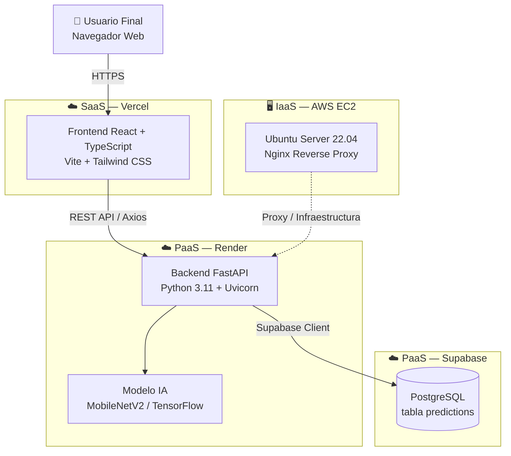

# Arquitectura del Sistema — AI Vision API as a Service

## Resumen

La plataforma implementa una **arquitectura en tres capas** distribuida en servicios cloud según los modelos IaaS, PaaS y SaaS.

---

## Diagrama de Arquitectura



---

## Capas del Sistema

### Capa 1 — Presentación (SaaS)

| Elemento | Tecnología | Descripción |
|----------|-----------|-------------|
| Framework | React 18 + TypeScript | SPA con tipado estático |
| Build tool | Vite | Compilación ultra rápida |
| Estilos | Tailwind CSS | Utilidades CSS responsivas |
| HTTP Client | Axios | Llamadas REST al backend |
| Deploy | Vercel | CDN global, HTTPS automático |

**Responsabilidad**: Interfaz de usuario. Muestra el formulario de carga, la vista previa de imagen, el resultado de predicción y el historial.

**Por qué es SaaS**: El usuario accede desde el navegador sin instalar nada. Vercel provee la infraestructura de hosting, CDN, SSL y despliegue automático.

---

### Capa 2 — Lógica de Negocio (PaaS)

| Elemento | Tecnología | Descripción |
|----------|-----------|-------------|
| Framework | FastAPI | API REST asíncrona, Swagger automático |
| Runtime | Python 3.11 + Uvicorn | Servidor ASGI de alto rendimiento |
| Modelo IA | MobileNetV2 (TensorFlow/Keras) | CNN preentrenada con ImageNet (1000 clases) |
| Imágenes | Pillow | Preprocesamiento: RGB, resize 224x224 |
| Deploy | Render | PaaS administrado, escalado automático |

**Responsabilidad**: Recibir la imagen, validarla, procesarla con el modelo de IA, persistir el resultado y devolver la respuesta JSON.

**Por qué es PaaS**: Render gestiona el servidor, el runtime Python, el despliegue desde GitHub, el escalado y el certificado SSL. El equipo solo gestiona el código.

---

### Capa 3 — Datos (PaaS)

| Elemento | Tecnología | Descripción |
|----------|-----------|-------------|
| Base de datos | PostgreSQL | Motor relacional robusto |
| Proveedor | Supabase | BaaS (Backend as a Service) sobre PostgreSQL |
| Seguridad | Row Level Security | Políticas de acceso a nivel de fila |
| Cliente | supabase-py | SDK oficial de Python |

**Responsabilidad**: Persistir y recuperar el historial de predicciones.

**Por qué es PaaS**: Supabase administra el servidor PostgreSQL, los backups, la escalabilidad, la autenticación y las APIs. El equipo solo define el esquema y las políticas.

---

### Componente IaaS — AWS EC2

| Elemento | Valor |
|----------|-------|
| Proveedor cloud | Amazon Web Services (AWS) |
| Servicio | EC2 (Elastic Compute Cloud) |
| Sistema operativo | Ubuntu Server 22.04 LTS |
| Tipo de instancia recomendado | t2.micro (Free Tier) |
| Uso en el proyecto | Nginx reverse proxy, ambiente de pruebas, evidencia de administración de infraestructura |

**Por qué es IaaS**: AWS provee el hardware virtualizado (cómputo, red, almacenamiento). El equipo instala y configura el sistema operativo, el software (Nginx, Docker) y las reglas de seguridad. A diferencia de PaaS, aquí hay administración directa de la infraestructura.

---

## Flujo de datos

```
1. Usuario selecciona imagen en el browser
2. Frontend valida tamaño/tipo localmente
3. Frontend envía POST /api/predict con multipart/form-data (Axios)
4. Backend valida extensión y tamaño (FastAPI)
5. Backend carga imagen con Pillow → convierte RGB → resize 224×224
6. Backend ejecuta MobileNetV2.predict() → decode_predictions()
7. Backend llama save_prediction() → Supabase inserta en tabla predictions
8. Backend retorna JSON { filename, prediction, confidence, model, created_at, saved }
9. Frontend muestra resultado en PredictionResult
10. Frontend refresca historial GET /api/history → PredictionHistory
```

---

## Diferenciación IaaS / PaaS / SaaS

| Modelo | Qué administra el equipo | Qué administra el proveedor |
|--------|--------------------------|----------------------------|
| **IaaS** (EC2) | SO, Nginx, Docker, seguridad, red | Hardware físico, virtualización, red básica |
| **PaaS** (Render) | Código Python, variables de entorno | Servidor, runtime, despliegue, SSL |
| **PaaS** (Supabase) | Esquema SQL, políticas RLS | Motor PostgreSQL, backups, APIs, seguridad |
| **SaaS** (Vercel) | Código React, variables de entorno | Hosting, CDN, SSL, despliegue, dominio |

---

## Seguridad de la Arquitectura

- **HTTPS** en todos los servicios cloud (Render, Vercel).
- **CORS** configurado en el backend para aceptar solo orígenes autorizados.
- **Service Role Key** de Supabase solo en variables del servidor (Render), nunca en frontend.
- **Validación** de tipo y tamaño de imagen en el backend antes de procesarla.
- **Row Level Security** en Supabase para proteger acceso a datos.
- **`.env` y `.pem`** en `.gitignore`, nunca en el repositorio.
